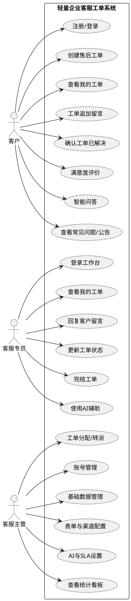

# 三、UML 用例图（最终版）

## 3.1 用例图说明

用例图描述系统对外提供的功能及参与者之间的关系。系统包含三个主要参与者（客户、客服专员、客服主管），系统本身作为边界与支撑（认证、推送、通知、AI），共 20 个用例。

## 3.2 参与者与用例清单

### 客户用例

| 编号 | 用例 | 说明 |
| --- | --- | --- |
| UC01 | 注册/登录 | 客户注册账号或登录系统 |
| UC02 | 创建售后工单 | 填写标题、分类、优先级、问题描述及自定义表单字段并提交 |
| UC03 | 查看我的工单 | 查看本人全部工单及状态 |
| UC04 | 工单追加留言 | 对未完结工单补充说明 |
| UC05 | 确认工单已解决 | 认可客服处理结果，关闭工单 |
| UC06 | 满意度评价 | 工单完结后 1-5 分评分 + 评语 |
| UC07 | 智能问答 | 提问并从知识库（FAQ）获得答案 |
| UC08 | 查看常见问题/公告 | 浏览 FAQ 与系统公告 |

### 客服专员用例

| 编号 | 用例 | 说明 |
| --- | --- | --- |
| UC09 | 登录工作台 | 客服登录并进入工作台 |
| UC10 | 查看我的工单 | 查看分配给本人的工单（含待处理/超时提醒） |
| UC11 | 回复客户留言 | 回复客户留言（支持快捷回复与 AI 建议） |
| UC12 | 更新工单状态 | 处理中 / 待客户确认等状态流转 |
| UC13 | 完结工单 | 将已解决工单标记完结 |
| UC14 | 使用 AI 辅助 | 生成回复建议、工单摘要、自动分类 |

### 客服主管用例

| 编号 | 用例 | 说明 |
| --- | --- | --- |
| UC15 | 工单分配/转派 | 将工单指派或转派给在岗客服 |
| UC16 | 账号管理 | 创建/编辑/启用/禁用客户与客服账号 |
| UC17 | 基础数据管理 | 分类、FAQ、公告、快捷回复的增删改 |
| UC18 | 表单与渠道配置 | 自定义工单表单字段、接入渠道开关与配置 |
| UC19 | AI 与 SLA 设置 | AI 接口配置、自动分配开关、SLA 策略 |
| UC20 | 查看统计看板 | 全局工单统计、趋势、客服绩效、CSAT |

## 3.3 用例图文字描述

```
【客户】——使用——> UC01 注册/登录、UC02 创建售后工单、UC03 查看我的工单、UC04 追加留言、
                    UC05 确认已解决、UC06 满意度评价、UC07 智能问答、UC08 查看FAQ/公告
【客服专员】——使用——> UC09 登录工作台、UC10 查看我的工单、UC11 回复留言、UC12 更新状态、
                         UC13 完结工单、UC14 AI辅助
【客服主管】——使用——> UC15 分配/转派、UC16 账号管理、UC17 基础数据管理、UC18 表单与渠道配置、
                        UC19 AI与SLA设置、UC20 统计看板
系统边界：轻量企业客服工单系统（用例均位于边界内部）
```

## 3.4 PlantUML 源码（可复制到 StarUML / ProcessOn）



## 3.5 绘制要点

1. 三个参与者置于系统边界矩形外，20 个用例置于边界内；
2. 客户与客服专员使用同一系统前台/后台，通过角色区分权限；
3. 可为 UC02「创建售后工单」添加 `<<include>>` 指向 UC01「注册/登录」；
4. UC15 分配/转派可由 UC17 基础数据管理提供客服名单（可选 `<<extend>>` 标注）。
