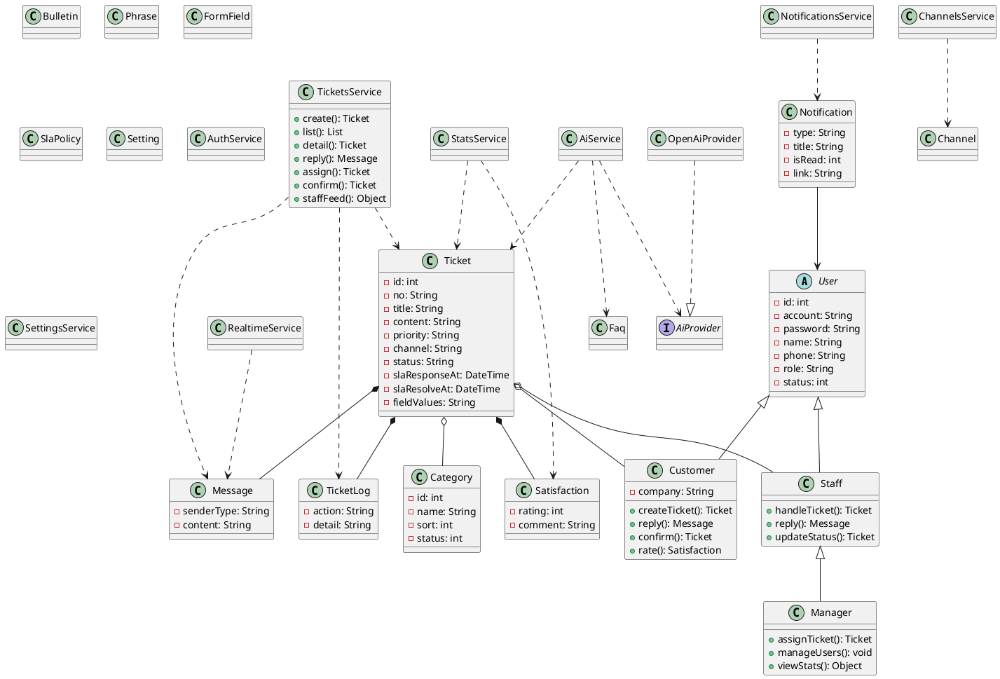

# 四、UML 类图（最终版）

## 4.1 设计要素

类图覆盖五种建模关系：

| 关系 | 示例 |
| --- | --- |
| 继承（泛化） | Customer、Staff 继承抽象类 User；Manager 继承 Staff |
| 扩展/实现 | OpenAiProvider 实现 AiProvider 接口（AI 提供方可插拔） |
| 聚合（整体-部分，可独立存在） | Ticket ◇ Category / Staff / Customer（引用关系） |
| 组合（强归属，随整体消亡） | Ticket ◆ Message / TicketLog / Satisfaction |
| 关联 | Notification → User；Satisfaction → Ticket |

实体类：User 体系、Category、Ticket、Message、TicketLog、Satisfaction、Notification、Faq、Bulletin、Phrase、FormField、Channel、SlaPolicy、Setting

辅助类（业务逻辑）：TicketsService、AuthService、AiService、StatsService、RealtimeService、NotificationsService、ChannelsService、SettingsService，以及守卫 JwtAuthGuard / RolesGuard。

## 4.2 核心类定义

### 1. User（抽象类，实体类）

| 要素 | 内容 |
| --- | --- |
| 属性 | id、account（账号）、password（加密存储）、name、phone、role（角色）、status（状态） |
| 说明 | 所有用户的公共基类，`role` 区分客户/客服/主管 |

### 2. Customer / Staff / Manager（子类）

| 类 | 继承 | 特有内容 |
| --- | --- | --- |
| Customer | User | company（公司）；方法 createTicket()、reply()、confirm()、rate() |
| Staff | User | handleTicket()、reply()、updateStatus() |
| Manager | Staff | assignTicket()、manageUsers()、viewStats()（继承客服全部权限） |

### 3. Ticket（核心实体类）

| 要素 | 内容 |
| --- | --- |
| 属性 | id、no（工单号）、title、content、categoryId、customerId、staffId、priority（优先级）、channel（渠道）、status（状态）、slaResponseAt、slaResolveAt、fieldValues、closedAt |
| 关系 | 组合 Message / TicketLog / Satisfaction；聚合 Category / Customer / Staff |

### 4. 工单附属实体类

| 类 | 说明 |
| --- | --- |
| Message | 留言（senderType：客户/客服/系统），随工单组合 |
| TicketLog | 操作留痕（创建/分配/转派/回复/状态/确认） |
| Satisfaction | 满意度（rating 1-5 + comment），与工单 1:1 |
| Notification | 站内通知（type、title、isRead、link），关联 User |

### 5. 基础数据与配置实体类

Category（工单分类）、Faq（常见问题）、Bulletin（公告）、Phrase（快捷回复）、FormField（自定义表单字段）、Channel（接入渠道）、SlaPolicy（SLA 策略）、Setting（键值设置）。

### 6. 辅助业务类（Service）

| 类 | 职责 |
| --- | --- |
| TicketsService | 工单创建/查询/留言/状态/分配转派/确认，触发通知与实时推送 |
| AuthService | 登录、注册、当前用户 |
| AiService | 回复建议、摘要、自动分类、知识库问答（RAG），依赖 AiProvider 接口 |
| StatsService | 看板统计（趋势/响应时长/CSAT/绩效） |
| RealtimeService / RealtimeGateway | Socket.IO 实时推送 |
| NotificationsService | 站内通知写入与已读 |
| ChannelsService | 渠道配置与入站 webhook 建单 |
| SettingsService | 键值设置（AI/自动分配开关） |

## 4.3 关系汇总表

| 关系类型 | 双方 | 说明 |
| --- | --- | --- |
| 继承 | Customer / Staff → User | 客户与客服继承用户公共属性 |
| 继承 | Manager → Staff → User | 主管继承客服全部能力 |
| 扩展/实现 | OpenAiProvider → AiProvider | AI 提供方接口实现，可替换 |
| 组合 | Ticket ◆ Message | 一个工单由多条留言构成 |
| 组合 | Ticket ◆ TicketLog | 操作留痕随工单存在 |
| 组合 | Ticket ◆ Satisfaction | 一个工单一条评价 |
| 聚合 | Ticket ◇ Category | 分类独立存在，工单引用 |
| 聚合 | Ticket ◇ Staff / Customer | 人员独立存在，工单引用 |
| 关联 | Notification → User | 通知发给用户 |
| 依赖 | TicketsService → Ticket/Message/TicketLog | 辅助类操作实体类 |
| 依赖 | AiService → Faq/Ticket | AI 检索知识库与工单 |

## 4.4 PlantUML 源码（可复制到 StarUML / ProcessOn）

## 4.5 绘制要点

1. `User` 为抽象类，子类用空心三角实线指向父类；
2. 组合用实心菱形（Message/TicketLog/Satisfaction），聚合用空心菱形（Category/Staff/Customer）；
3. 辅助类与实体类之间用虚线依赖；
4. AI 提供方用接口+实现表达"扩展"关系，体现可插拔设计。
