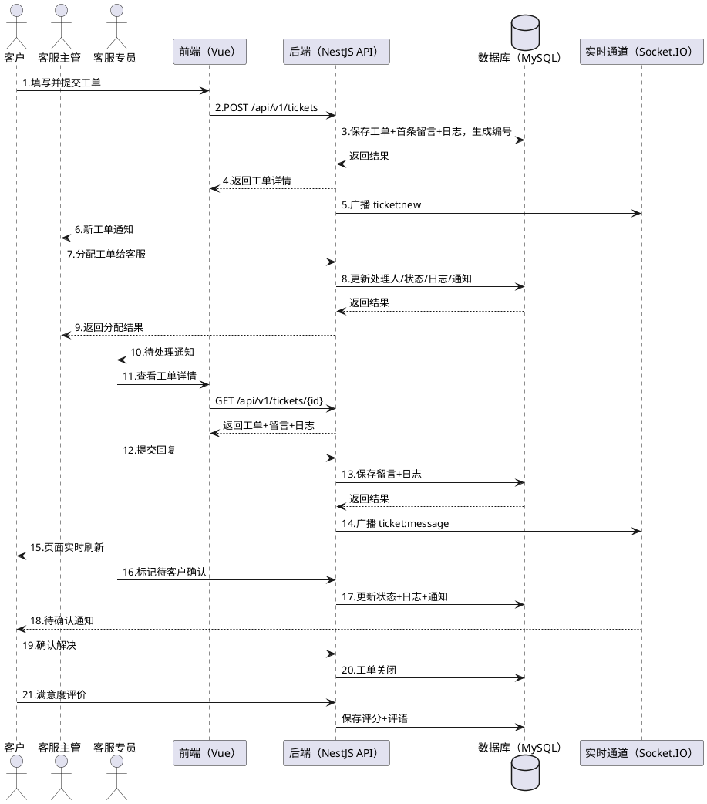

# 五、UML 时序图（最终版）

## 5.1 场景说明

时序图覆盖核心业务闭环：**客户创建工单 → 系统通知主管 → 主管分配 → 客服回复（实时推送） → 客服标记待确认 → 客户确认解决 → 满意度评价**。

## 5.2 参与对象

| 对象 | 角色 |
| --- | --- |
| 客户 | 工单发起者与确认者 |
| 前端（Vue） | 用户界面，负责交互展示 |
| 后端（NestJS API） | 业务处理、数据持久化、通知与实时推送触发 |
| 数据库（MySQL） | 数据存储 |
| 实时通道（Socket.IO） | 留言/状态变更实时推送 |
| 客服主管 / 客服专员 | 分配者 / 处理者 |

## 5.3 时序步骤

| 步骤 | 发送者 | 接收者 | 交互内容 |
| --- | --- | --- | --- |
| 1 | 客户 | 前端 | 填写标题、分类、优先级与描述，提交工单 |
| 2 | 前端 | 后端 | POST /api/v1/tickets |
| 3 | 后端 | 数据库 | 保存工单 + 首条留言 + 创建日志，生成工单编号 |
| 4 | 后端 | 前端 | 返回工单详情 |
| 5 | 后端 | 实时通道 | 广播 ticket:new |
| 6 | 实时通道 | 客服主管 | 收到新工单通知（站内通知 + 铃铛角标） |
| 7 | 客服主管 | 后端 | 选择客服，分配工单 |
| 8 | 后端 | 数据库 | 更新处理人、状态与日志，写入通知 |
| 9 | 后端 | 前端 | 返回分配结果 |
| 10 | 实时通道 | 客服专员 | 收到待处理通知 |
| 11 | 客服专员 | 前端 | 查看工单详情 |
| 12 | 客服专员 | 后端 | 提交回复内容 |
| 13 | 后端 | 数据库 | 保存留言与日志 |
| 14 | 后端 | 实时通道 | 广播 ticket:message |
| 15 | 实时通道 | 客户 | 页面实时刷新，看到回复 |
| 16 | 客服专员 | 后端 | 标记工单"待客户确认" |
| 17 | 后端 | 数据库 | 更新状态与日志 |
| 18 | 实时通道 | 客户 | 收到待确认通知 |
| 19 | 客户 | 后端 | 确认解决 |
| 20 | 后端 | 数据库 | 工单关闭（status=closed，记录 closedAt） |
| 21 | 后端 | 数据库 | 保存满意度评价（rating + comment） |

## 5.4 PlantUML 源码（可复制到 StarUML / ProcessOn）

## 5.5 绘制要点

1. 同步 REST 调用用实线箭头，返回用虚线箭头；
2. 数据库为 `database` 元件，突出持久化节点；
3. 实时推送（步骤 5/10/14/18）体现 Socket.IO 的广播特性；
4. 前端与后端的分离边界清晰：交互在前端，业务在后端。
