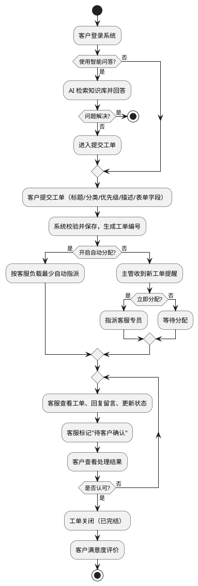

# 六、UML 活动图（最终版）

## 6.1 场景说明

活动图描述**工单完整生命周期**：从客户进入系统开始，经过智能问答分流、工单创建、分配（人工或自动）、客服沟通处理、客户确认，到工单关闭与满意度评价结束，包含多个判断节点与循环。

## 6.2 活动流程

```
开始 → 客户登录系统
        ↓
是否使用智能问答？ ├ 是 → AI 检索知识库并回答 → 问题解决？ ├ 是 → 结束
                                        ↓ 否                          ↓ 否
                                        └─────────────→ 进入提交工单 ←─┘
        ↓ 否
客户提交工单（标题/分类/优先级/描述/表单字段）
        ↓
系统校验并保存，生成工单编号
        ↓
是否开启自动分配？ ├ 是 → 按客服负载最少自动指派
        └ 否 → 主管收到新工单提醒 → 是否立即分配？ ├ 否 → 等待分配
                                                      └ 是 → 指派客服专员
        ↓
客服查看工单、回复留言、更新状态（循环体）
        ↓
客服标记"待客户确认"
        ↓
客户查看处理结果 → 是否认可？ ├ 否 → 追加留言，工单回到处理中（回到循环体）
                                └ 是 → 工单关闭（已完结）
        ↓
客户满意度评价
        ↓
结束
```

## 6.3 节点清单

| 节点类型 | 节点 | 说明 |
| --- | --- | --- |
| 初始节点 | 开始 | 流程入口 |
| 活动 | 客户登录系统 | 身份认证 |
| 判断 | 是否使用智能问答？ | 自助分流 |
| 活动 | AI 检索知识库并回答 | 知识库问答（RAG） |
| 活动 | 客户提交工单 | 含自定义表单字段 |
| 活动 | 系统校验并保存 | 生成工单编号，状态=待分配 |
| 判断 | 是否开启自动分配？ | 系统设置开关 |
| 活动 | 按负载自动指派 / 指派客服专员 | 分配分支 |
| 活动 | 等待分配 | 未分配状态 |
| 循环体 | 客服查看/回复/更新状态 | 沟通处理循环 |
| 活动 | 客服标记待客户确认 | 状态→待客户确认 |
| 判断 | 是否认可？ | 否→回到循环体；是→关闭 |
| 活动 | 工单关闭 | 状态→已完结 |
| 活动 | 客户满意度评价 | 评分 + 评语 |
| 终止节点 | 结束 | 流程出口 |

## 6.4 PlantUML 源码（可复制到 StarUML / ProcessOn）



## 6.5 绘制要点

1. 圆角矩形表示活动、菱形表示判断、实心圆开始、靶心圆结束；
2. "是否认可"判断的"否"分支通过循环回到沟通处理，体现未解决时反复沟通；
3. 可加泳道（客户 / 客服 / 主管 / 系统）划分职责范围；
4. 活动图与用例规约、时序图互相印证，覆盖同一核心闭环。
